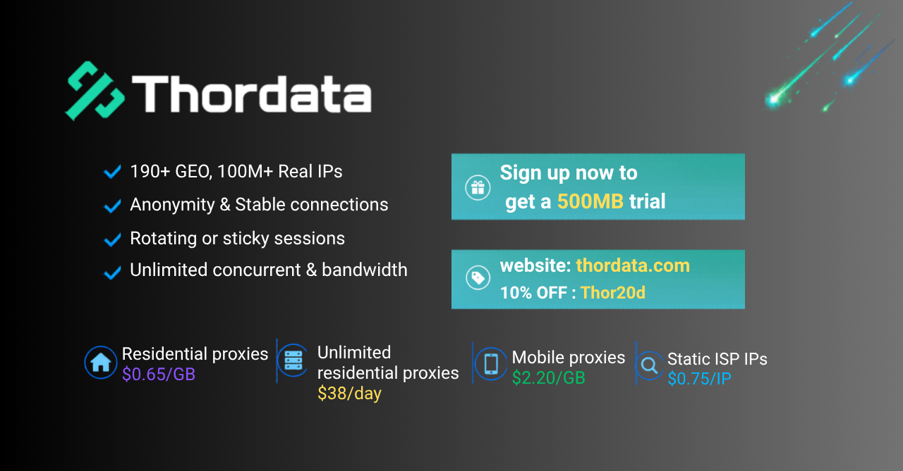

# Universal Web Target Runner

[](https://www.python.org/)
[](LICENSE)
[](https://www.selenium.dev/)
[]()

Universal Web Target Runner is a configurable automation runner for authorized web workflows. It provides reusable browser/session setup, email verification support, regional browser settings, proxy integration, and target adapters.

Use this only for websites and workflows you own, test, or are explicitly authorized to automate.

## Sponsors

[](https://www.swiftproxy.net/?ref=awsbuilderid)

[Swiftproxy](https://www.swiftproxy.net/?ref=awsbuilderid) provides residential proxy coverage across many regions, with dynamic traffic and trial options. Discount code: `PROXY90`

<a href="https://www.thordata.com/?ls=add&lk=add"></a>

[Thordata Proxy](https://www.thordata.com/?ls=add&lk=add) provides dynamic residential, static ISP, mobile, and unlimited residential proxy products.

## Targets

| Target | Description |
|--------|-------------|
| `web_signup` | Configurable browser signup flow. The default config is an AWS Builder ID example. |
| `generic_signup` | YAML-driven authorized form flow. Requires `authorized: true` in its config. |

The old `aws_builder` target name still works as a legacy alias, but new docs and commands use `web_signup`.

## Features

| Feature | Description |
|---------|-------------|
| Target architecture | Select adapters with `--target`; site behavior lives in config. |
| Regional profiles | Locale, timezone, Accept-Language, and geolocation settings. |
| Device profiles | Desktop and mobile User-Agent support. |
| Browser setup | Shared Selenium session factory with temporary profile cleanup. |
| Proxy support | Static proxy and dynamic proxy API modes. |
| Email verification | Temporary mailbox polling and Outlook IMAP support. |
| Fingerprint controls | Basic hardware, timezone, geolocation, WebGL, and WebRTC controls. |

## Quick Start

```bash
git clone https://github.com/38st/universal-web-target-runner.git
cd universal-web-target-runner
pip install -r requirements.txt
```

Configure `config/config.yaml` with your email worker, region, browser, and proxy settings.

Run the default target:

```bash
python src/runners/main.py
```

List targets:

```bash
python src/runners/main.py --list-targets
```

Run the web signup target with the AWS Builder ID example config:

```bash
python src/runners/main.py --target web_signup --target-config config/targets/aws_builder_id.yaml
```

Run a YAML-defined generic flow:

```bash
python src/runners/main.py --target generic_signup --target-config config/targets/generic_signup.example.yaml
```

## Configuration

Shared settings live in `config/config.yaml`.

Target-specific settings live in `config/targets/`.

The `web_signup` target also supports:

- `WEB_SIGNUP_CONFIG`: preferred env var for its config path
- `AWS_BUILDER_CONFIG`: legacy fallback env var

## Output

Target results are written to the JSONL file configured by the selected target. The included `web_signup` example writes to `accounts.jsonl`.

```json
{
  "email": "user@example.test",
  "password": "generated-password",
  "name": "Generated Name",
  "created_at": "2026-06-22 10:00:00",
  "status": "registered"
}
```

## Project Layout

```text
config/        Shared and target config
docs/          Usage guides
scripts/       Helper scripts
src/core/      Shared runtime primitives
src/runners/   CLI entry points
src/services/  Email and mailbox services
src/targets/   Target adapters
```

## Useful Scripts

```bash
python scripts/switch_region.py usa
python scripts/switch_device.py mobile
python scripts/check_proxy.py
python scripts/check_fingerprint.py
```

## Documentation

- [Usage](docs/USAGE.md)
- [Proxy Guide](docs/PROXY_GUIDE.md)
- [Fingerprint Guide](docs/FINGERPRINT_GUIDE.md)
- [Mobile Guide](docs/MOBILE_GUIDE.md)
- [Region Guide](docs/README_REGION.md)

## Disclaimer

This project is for learning, testing, and authorized automation research. You are responsible for complying with target site terms and applicable laws.

## License

[MIT License](LICENSE)
